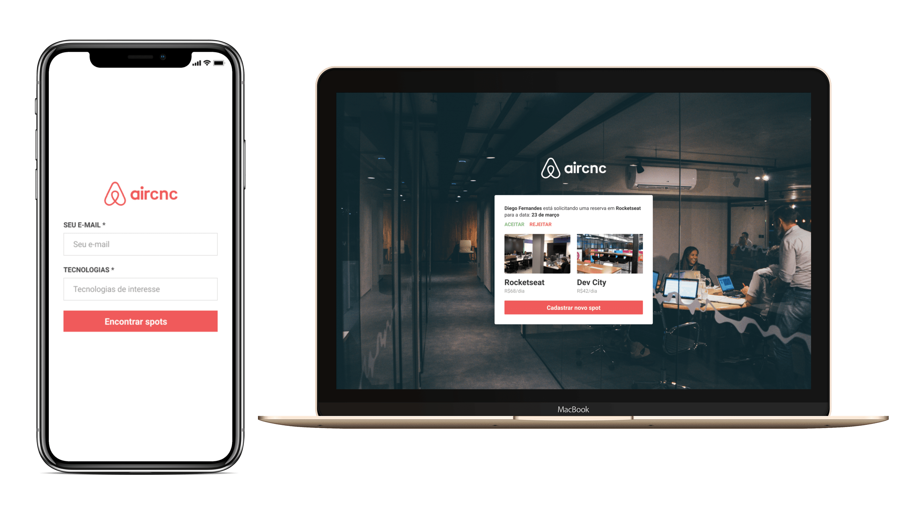
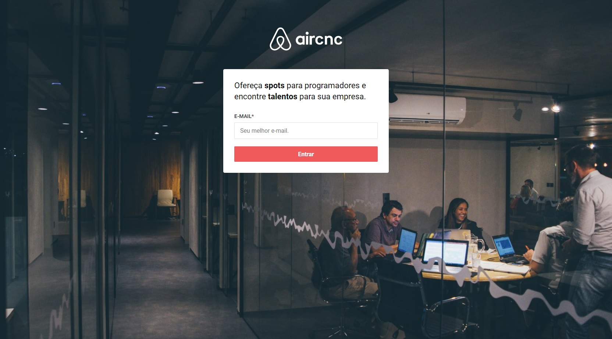
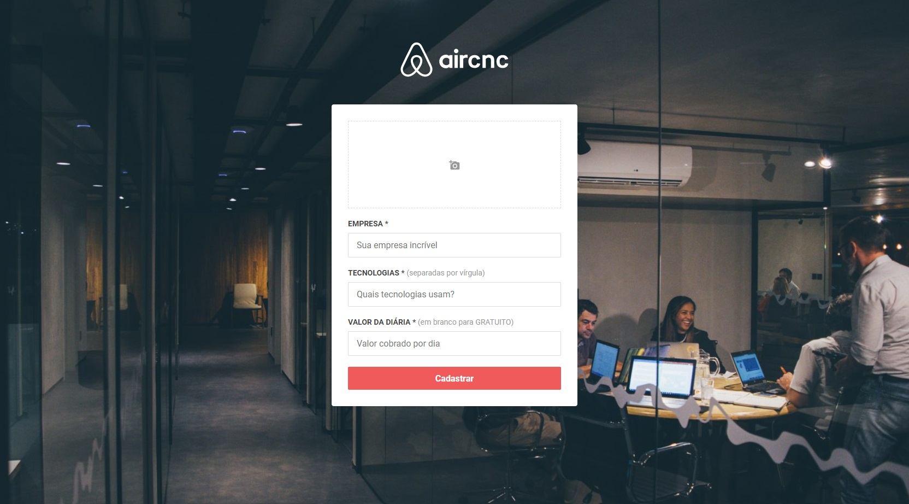
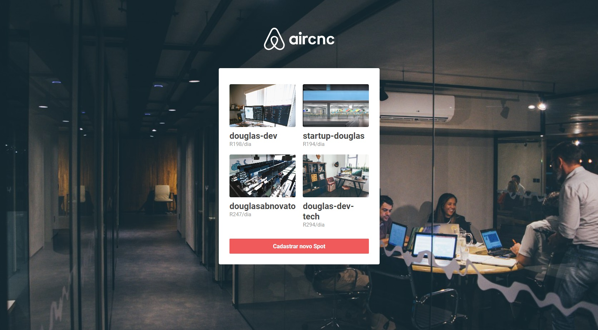
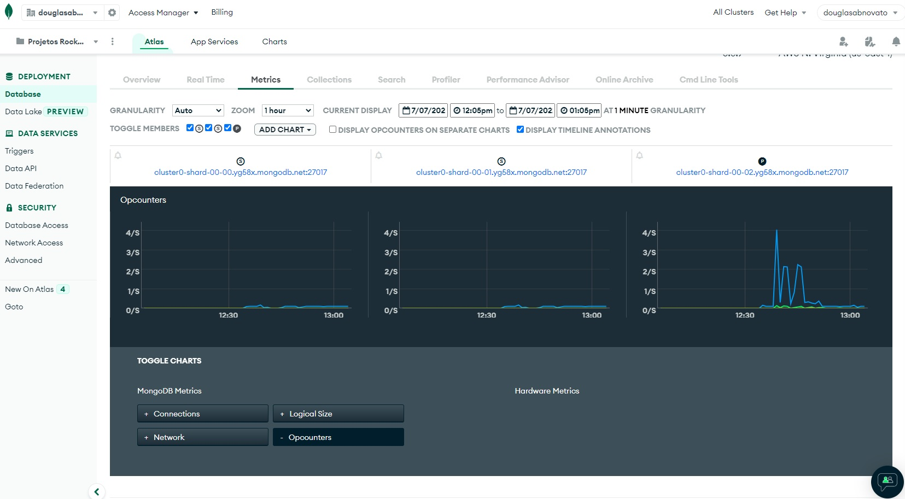
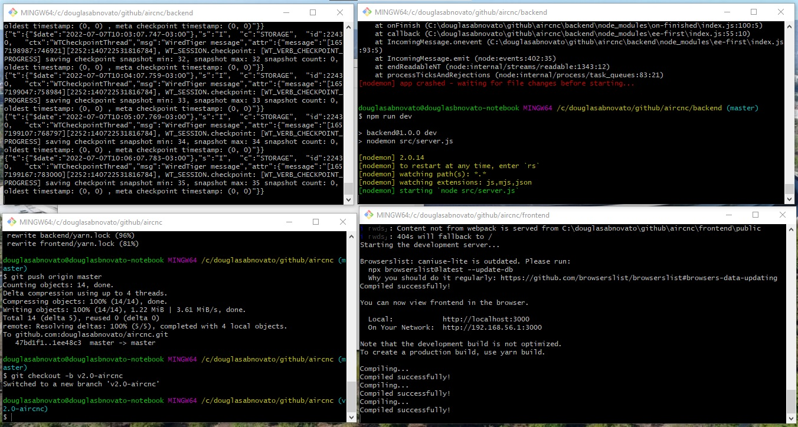

<h1 align="center">
    
</h1> 

<p align="center">
  
</p>

## 💻 Projeto

O Aircnc é um projeto que visa conectar empresas que querem abrir spots e desenvolvedores que procuram um lugar para trocar ideias com devs, conhecer a empresa e trabalhar lá por um período. 

Compartilhar espaços de empresas para programadores externos conhecerem ou até mesmo, trabalharem. Promover esses espaços de forma gratuita ou alugada.

Um módulo para a empresa cadastrar seus espaços. E o outro módulo para quem está interessado em usar esse espaço.

## 🌐 Em produção

- Web: https://aircnc-web.onrender.com (site estático no Render)
- API: https://aircnc-api.onrender.com/health (Render Free + MongoDB Atlas M0)
- Passo a passo do deploy: [docs/DEPLOY.md](docs/DEPLOY.md). O app mobile não é publicado: roda no Expo Go apontando para a API.
- Limites do plano gratuito: a API dorme após 15 min sem acesso (cerca de 1 min para acordar) e as imagens enviadas ficam em disco temporário.

## :rocket: Tecnologias

Esse projeto foi desenvolvido com as seguintes tecnologias:

- [Node.js](https://nodejs.org/en/)
- [React](https://reactjs.org)
- [React Native](https://facebook.github.io/react-native/)
- [Expo](https://expo.io/)

## 🎨 Layout

🎨 Aircnc - Web

<p align="center" style="display: flex; align-items: flex-start; justify-content: center;">
  
  
  
</p> 

🚀 Aircnc - Ambiente em desenvolvimento

<p align="center" style="display: flex; align-items: flex-start; justify-content: center;">
  
  
</p> 

#### Conhecendo a Omnistack 9.0
- [x] Aplicação que será desenvolvida
- [x] Tecnologias utilizadas
- [x] Configuração de Ambiente
- [x] Npm[6.14.6], Node[14.16.1], Yarn[1.22.10]
- [x] VSCode, Drácula Oficial, Material Icon Theme, Rocketseat Reactjs, Fira Code
- [x] Expo

#### Criando a base da aplicação
- [x] construir o back-end da sua aplicação
- [x] api rest: um backend separado do frontend 
- [x] `yarn add express` ou `npm add express` - localhost:3333 : rotas
- [x] `npm install nodemon -D` - reiniciar servidor node a cada alteração : error
- [x] `yarn dev` - rodar aplicação com o nodemon - `npm run dev`: error
- [x] mongoose : `yarn add mongoose` : editar o mongoDB 
- [x] Partner - MVC : estrutura de pastas 
- [x] Testar requisições Http: get, post, put, delete no insominia
- [x] Parâmetros - req.query: acessar query params para filtros
- [x] Parâmetros - req.params: acessar route params para edição e deleção
- [x] Parâmetros - req.body: acessar o corpo da requisição para criação e edição  
- [x] banco de dados: mongoDB atlas cloud 
- [x] Multer: armazenar arquivos: `npm install multer`

#### Construindo a interface web 
- [x] criar o projeto: `yarn create react-app frontend` 
- [x] rodar a aplicação frontend: `yarn run start`
- [x] iniciar projeto: `npm start`
- [x] Estrutura App.js e Estilização App.css
- [x] Primeira tela
- [x] Chamadas API: axios ou fetch
- [x] Fundamentos: componentização e estado
- [x] Configurar o cors no backend: `npm install cors`
- [x] comunicação com a api
- [x] salvando informações no localstorage
- [x] instalar e configurar sistema de rotas: `npm install react-router-dom`
- [x] instalar e configurar sistema de arquivo: useMemo
- [x] mudado de history.push() para navigate()

#### Desenvolvendo o app mobile  
- [x] Instalar expo: `npm install -g expo-cli` 
- [x] Criar projeto com expo: `expo init mobile --template blank` 
- [x] Navegação: `yarn add react-navigation` 
- [x] Animações Navegação: `expo install react-native-gesture-handler react-native-reanimated` 
- [x] Estilização da page Login
- [x] axios - conectar a aplicação com o api: `yarn add axios`
- [x] services/api - baseURL: 'http://192.168.0.31:3333'. Esse ip pode mudar.
- [x] configurar axios na função handleSubmit
- [x] AsyncStorage agora é `@react-native-async-storage/async-storage`

#### Funcionalidades avançadas 
- [x] Sincronizar realtime o front mobile e o front web com a lib socket.io.
- [x] socket.io no backend: `yarn add socket.io` 
- [x] socket.io no frontend: `yarn add socket.io-client` 
- [x] socket.io: comunicação ponta a ponta
- [x] socket.io: identificar qual é o usuário que está fazendo a conexão.
- [x] notificação do real time de adição de spot.
- [x] estilização da notificação
- [x] socket.io: configuração dentro do backend
- [x] socket.io: configuração dentro do frontend
- [x] socket.io: configuração dentro do mobile
- #omnistacknextlevel

#### Versão 2.0 (revisão de qualidade)
- [x] Senha do banco removida do código; configuração por `.env`
- [x] Sessão com token assinado; só o dono do spot aprova ou rejeita (antes qualquer pessoa, via GET)
- [x] Reserva e aprovação voltaram a funcionar; pedidos pendentes aparecem mesmo após recarregar
- [x] Upload só de imagens até 2 MB; tempo real autenticado (cada um recebe só os próprios avisos)
- [x] Web em Vite 8 + React 18, acessível (WCAG AA); app em Expo SDK 57 + React Navigation 7
- [x] 17 testes automatizados (API, tempo real e web)

Detalhes em [docs/ANALISE.md](docs/ANALISE.md), [docs/ARQUITETURA.md](docs/ARQUITETURA.md) e [docs/PLANO-DE-ACAO.md](docs/PLANO-DE-ACAO.md).

## 🚀 Como executar

Requisitos: Node 20+, uma conta gratuita no MongoDB Atlas e o app Expo Go no celular.

```bash
# API (http://localhost:3333)
cd backend && cp .env.example .env   # preencha MONGODB_URI e AUTH_SECRET
npm install && npm run dev
npm test

# Web (http://localhost:5173)
cd frontend && cp .env.example .env
npm install && npm run dev
npm test

# App (Expo Go)
cd mobile && cp .env.example .env    # EXPO_PUBLIC_API_URL = IP da sua máquina na rede
npm install && npx expo start
```

Deploy gratuito: `render.yaml` cria a API e o web no Render; o banco fica no MongoDB Atlas M0. Passo a passo em [docs/DEPLOY.md](docs/DEPLOY.md).

## 🤔 Como contribuir

- Faça um fork desse repositório;
- Cria uma branch com a sua feature: `git checkout -b minha-feature`;
- Faça commit das suas alterações: `git commit -m 'feat: Minha nova feature'`;
- Faça push para a sua branch: `git push origin minha-feature`.

Depois que o merge da sua pull request for feito, você pode deletar a sua branch.

## :memo: Licença

Esse projeto está sob a licença MIT. Veja o arquivo [LICENSE](LICENSE.md) para mais detalhes.

--- 

:. Feito com ♥ by [Douglas A B Novato](https://www.linkedin.com/in/douglasabnovato/) :wave: 

Fonte do Projeto: [Diego Fernandes - Rocketseat na Semana Omnistack 9.0](https://rocketseat.com.br/week-9/aulas)
