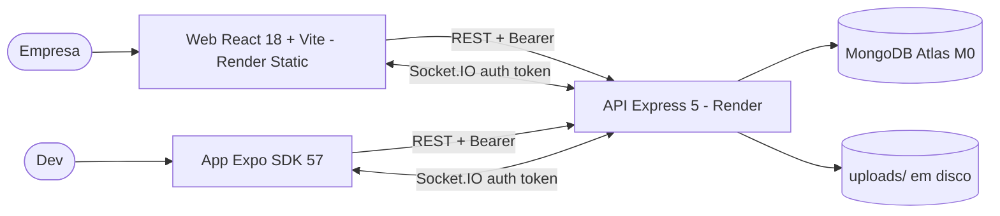
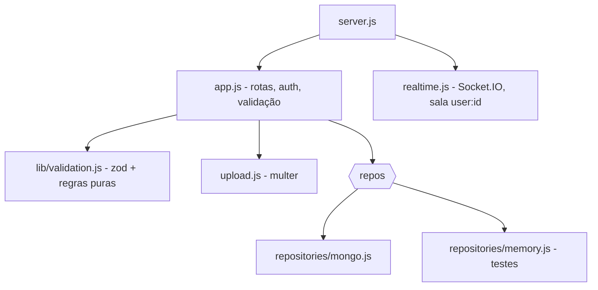

# Arquitetura — AirCnC

## 1. C4

## 2. Contrato da API

| Método | Rota | Auth | Resposta |
|---|---|---|---|
| POST | /sessions | — | `{ user, token }` |
| GET | /spots?tech= | — | spots públicos (sem id do dono) |
| POST | /spots | Bearer | 201 spot (multipart `thumbnail`) |
| GET | /dashboard | Bearer | meus spots |
| GET | /bookings/pending | Bearer | pedidos pendentes dos meus spots |
| POST | /spots/:id/bookings | Bearer | 201 reserva; 409 duplicada |
| POST | /bookings/:id/approvals \| /rejections | Bearer (dono) | reserva; 403 / 409 |

Eventos Socket.IO: `booking_request` (para o dono) e `booking_response` (para o dev). A conexão exige `auth.token`.

## 3. Modelo de dados

| Coleção | Campos | Índices |
|---|---|---|
| users | email | único |
| spots | thumbnail, company, price, techs, techsLower, user | user, techsLower |
| bookings | date (AAAA-MM-DD), approved (null/true/false), user, spot | único (user, spot, date) |

## 4. ADRs

| # | Decisão | Motivo | Alternativa |
|---|---|---|---|
| ADR-01 | Token JWT após login por e-mail | Corrige D2/D6 sem mudar a experiência | Senha ou link mágico — **decisão sua** (plano) |
| ADR-02 | Repositórios injetados (Mongo/memória) | Testar sem banco; trocar persistência | Mongoose direto nos controllers |
| ADR-03 | Validação de data só no servidor, aceitando DD/MM/AAAA | Uma regra para web e mobile | Validar em cada cliente |
| ADR-04 | Uploads em disco com nome aleatório | Mantém o original; simples | Cloudinary (grátis) — no Render Free o disco é apagado a cada deploy |
| ADR-05 | Expo SDK 57 + React Navigation 7 | SDK 43 não roda nos Expo Go atuais | Manter SDK 43 |
